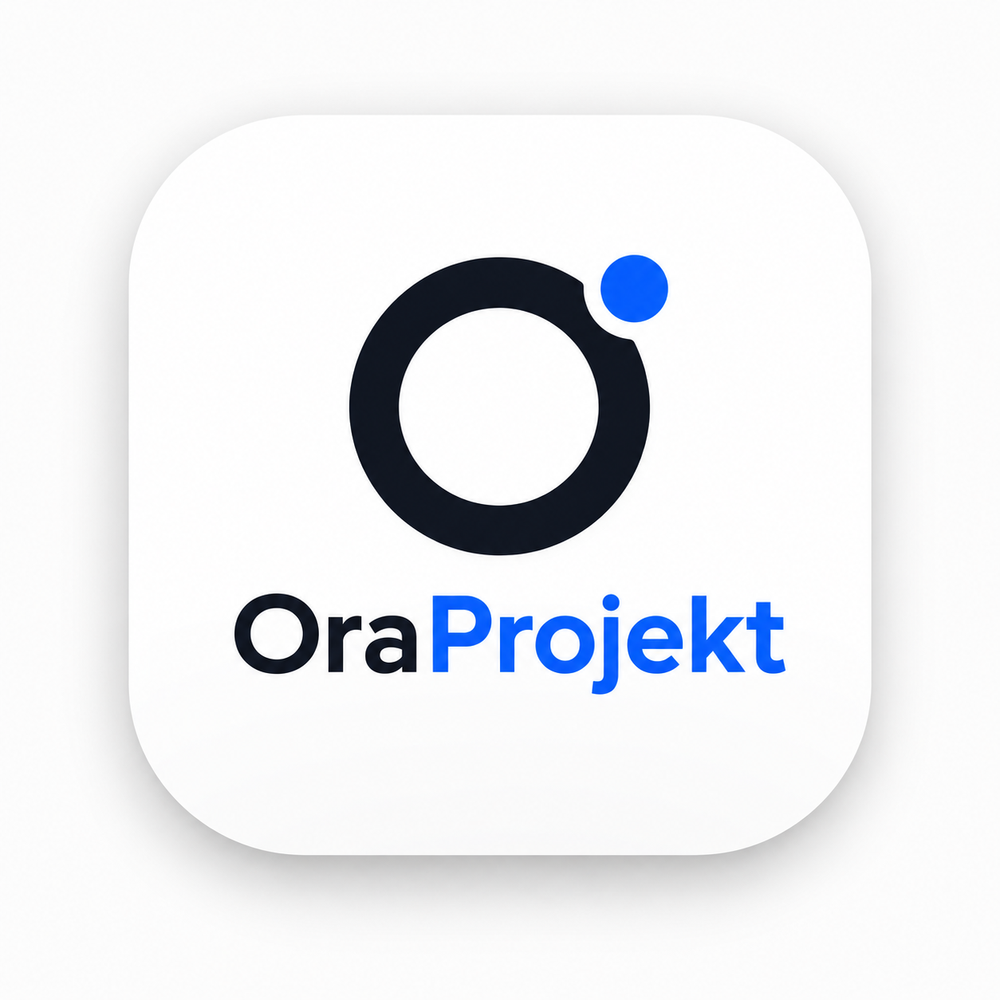
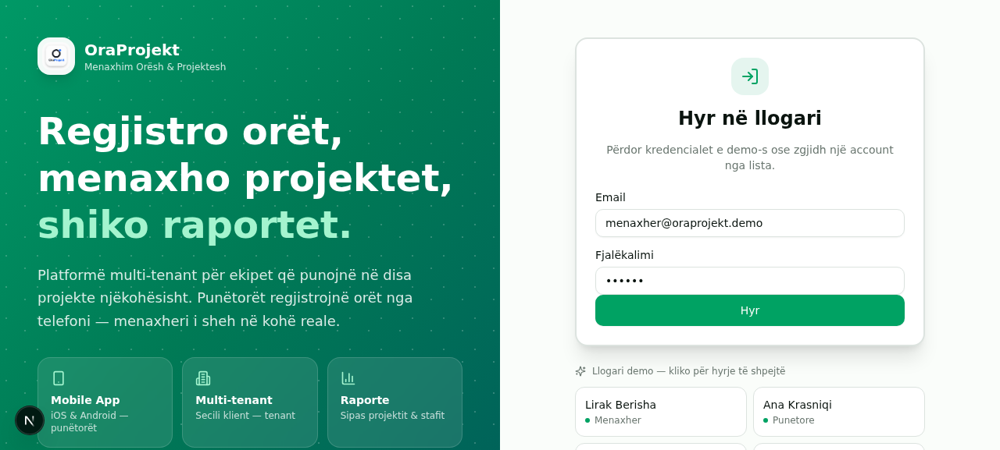
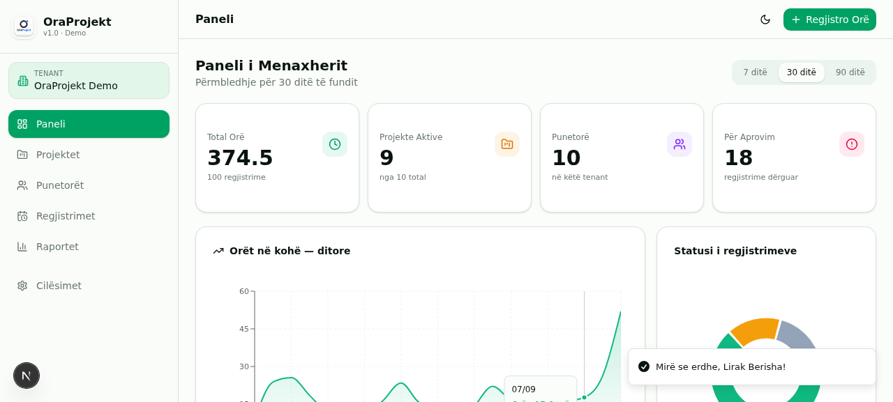
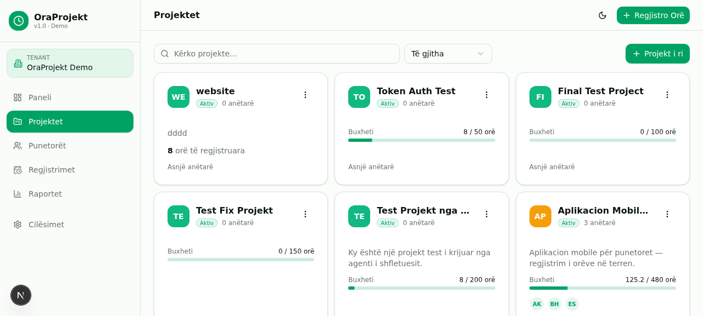
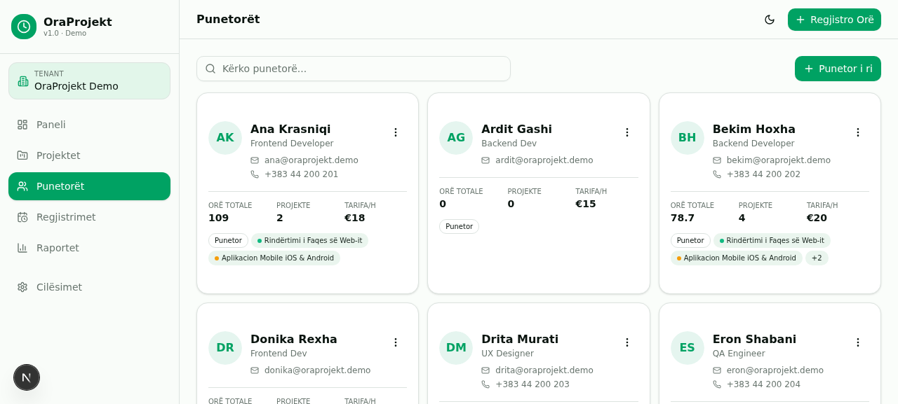
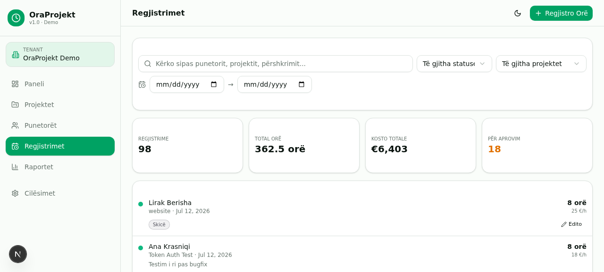
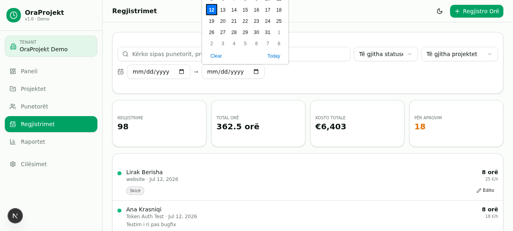
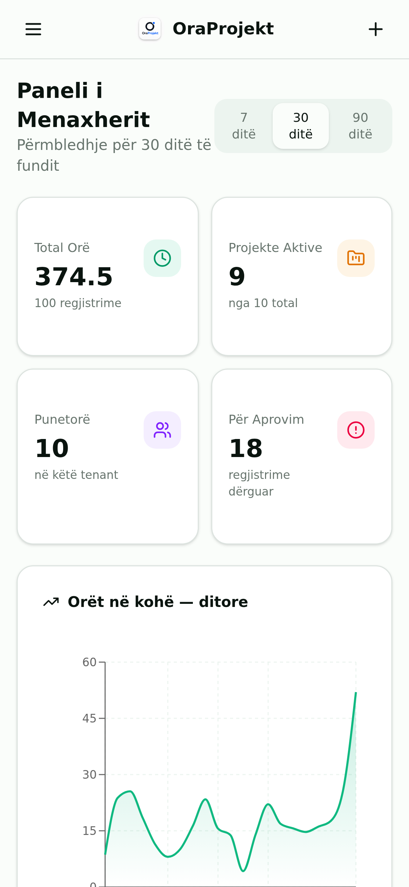
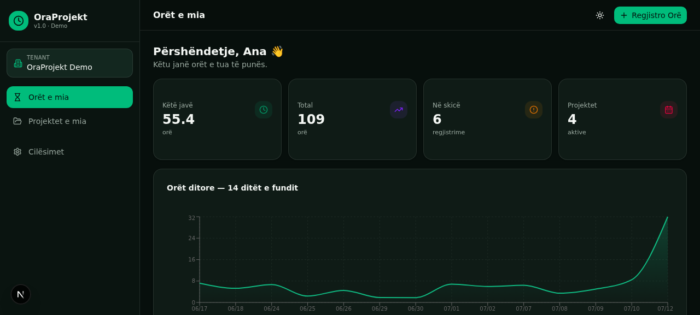
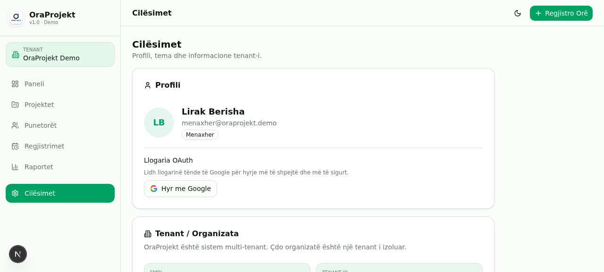

<div align="center">



# OraProjekt

### Sistem Multi-Tenant për Menaxhimin e Orëve të Punëtorëve

[](https://nextjs.org/)
[](https://www.typescriptlang.org/)
[](https://www.prisma.io/)
[](https://tailwindcss.com/)
[](LICENSE)

**Regjistro orët · Menaxho projektet · Shiko raportet**

Platformë web për ekipet që punojnë në disa projekte njëkohësisht. Punëtorët regjistrojnë orët nga telefoni, menaxherët i aprovojnë dhe shohin raporte mujore.

</div>

---

## 📸 Screenshots

### Ekran i Hyrjes (Login)


### Paneli i Menaxherit (Dashboard)


### Menaxhimi i Projekteve


### Menaxhimi i Punëtorëve


### Regjistrimet e Orëve me Aprovim


### Raportet me Grafikë


### Pamja Mobile (iOS/Android PWA)


### Mënyra e Errët (Dark Mode)


### Menaxhimi i Domenit të Tenant-it


---

## ✨ Features

### Për Menaxherët
- 📊 **Dashboard** — KPIs, grafikë orarë, statusi i aprovimeve
- 📁 **Projektet** — Krijim, editim, caktim ekipi, buxhet orësh
- 👥 **Punëtorët** — Krijim, editim, rolet (Manager/Employee), tarifë/orë
- ✅ **Aprovimet** — Aprovo/refuzo orët e dërguara nga punëtorët
- 📈 **Raportet** — Sipas projektit/punëtorit, eksport CSV, kosto totale
- 🌐 **Tenant Domains** — Lidh domain email me tenant për hyrje automatike OAuth

### Për Punëtorët
- ⏰ **Regjistro Orë** — Shto orë pune për projekte të caktuara
- 📅 **Orët e Mia** — Shiko historikun, filtro sipas statusit/datës
- 🗂️ **Projektet e Mia** — Shiko projektet ku je caktuar + rolin tënd
- 📱 **Mobile-First** — Instalohet si app në iOS/Android (PWA)

### Teknike
- 🔐 **Auth** — NextAuth v5 + Google/Microsoft OAuth + Credentials
- 🏢 **Multi-Tenant** — Izolim i plotë i të dhënave për çdo organizatë
- 🌓 **Dark/Light Mode** — Me respektim të preferencës së sistemit
- 📱 **Responsive** — Mobile, tablet, desktop
- ♿ **Accessible** — ARIA labels, keyboard navigation, WCAG compliant
- 🔒 **Security** — HMAC-SHA256 tokens, timing-safe comparison, input validation

---

## 🛠️ Tech Stack

| Layer | Teknologjia |
|-------|-------------|
| **Frontend** | Next.js 16, React 19, TypeScript 5, Tailwind CSS 4, shadcn/ui |
| **Backend** | Next.js Route Handlers (REST API) |
| **Database** | Prisma ORM + SQLite (dev) / PostgreSQL (prod) |
| **Auth** | NextAuth v5 + custom JWT + Google/Microsoft OAuth |
| **State** | Zustand (client), TanStack Query (server) |
| **Charts** | Recharts |
| **Icons** | Lucide React |
| **Package Manager** | Bun |

---

## 🚀 Quick Start

### Prerequisites

- [Bun](https://bun.sh/) v1.3+ (ose Node.js 18+ me npm)
- [Git](https://git-scm.com/)

### Installation

```bash
# 1. Clone repository
git clone https://github.com/erlisgashi67-commits/OraProjekt.git
cd OraProjekt

# 2. Install dependencies
bun install

# 3. Setup environment
cp .env.example .env
# Edit .env me vlerat e tua (DATABASE_URL, AUTH_SECRET, OAuth credentials)

# 4. Setup database
bun run db:push
bun run db:generate

# 5. Seed demo data (optional)
bun run scripts/seed.ts

# 6. Start dev server
bun run dev
```

Hap http://localhost:3000 në browser.

---

## 👤 Demo Accounts

| Email | Password | Rol |
|-------|----------|-----|
| `menaxher@oraprojekt.demo` | `123456` | Manager |
| `ana@oraprojekt.demo` | `123456` | Employee |
| `bekim@oraprojekt.demo` | `123456` | Employee |
| `drita@oraprojekt.demo` | `123456` | Employee |
| `eron@oraprojekt.demo` | `123456` | Employee |

---

## 📂 Struktura e Projektit

```
OraProjekt/
├── prisma/
│   └── schema.prisma              # Database schema (8 models)
├── public/                        # Static assets (logo, icons, manifest)
├── src/
│   ├── app/
│   │   ├── api/                   # REST API routes
│   │   │   ├── auth/              # Login, logout, session, NextAuth
│   │   │   ├── projects/          # Projects CRUD + assign
│   │   │   ├── employees/         # Employees CRUD
│   │   │   ├── timesheets/        # Timesheets CRUD + status workflow
│   │   │   ├── reports/           # Reports aggregation
│   │   │   └── tenant-domains/    # Domain mapping for OAuth
│   │   ├── globals.css            # Theme (emerald/teal) + utilities
│   │   ├── layout.tsx             # Root layout (metadata, fonts, providers)
│   │   └── page.tsx               # Main page (app shell, routing)
│   ├── components/
│   │   ├── ui/                    # shadcn/ui components (40+)
│   │   ├── views/                 # Page views
│   │   │   ├── manager-dashboard.tsx
│   │   │   ├── manager-projects.tsx
│   │   │   ├── manager-employees.tsx
│   │   │   ├── manager-timesheets.tsx
│   │   │   ├── manager-reports.tsx
│   │   │   ├── employee-my-hours.tsx
│   │   │   ├── employee-my-projects.tsx
│   │   │   └── settings-view.tsx
│   │   ├── app-shell.tsx          # Sidebar + topbar + content
│   │   ├── login-screen.tsx       # Login page with demo accounts
│   │   ├── log-time-dialog.tsx    # Log hours dialog
│   │   └── theme-provider.tsx     # Dark/light theme
│   ├── lib/
│   │   ├── api.ts                 # API client + formatters
│   │   ├── auth.ts                # Custom JWT session management
│   │   ├── auth.config.ts         # NextAuth config (Google/Microsoft)
│   │   ├── db.ts                  # Prisma client
│   │   ├── types.ts               # TypeScript types
│   │   └── utils.ts               # Utilities
│   └── store/
│       └── app.ts                 # Zustand store
├── docs/
│   ├── API.md                     # API reference (Confluence-ready)
│   ├── openapi.json               # OpenAPI 3.0 spec (Swagger/Postman)
│   └── screenshots/               # Screenshots për README
├── scripts/
│   ├── seed.ts                    # Database seeding
│   ├── cleanup-orphans.ts         # Cleanup orphaned records
│   ├── check-db.ts                # DB inspection
│   └── generate-icons.js          # PWA icon generator
├── .gitlab-ci.yml                 # GitLab CI/CD pipeline (4 stages)
├── Dockerfile                     # Multi-stage Docker build
├── docker-compose.yml             # Production deployment
├── Caddyfile                      # Reverse proxy + HTTPS
├── .env.example                   # Environment template
└── package.json
```

---

## 📊 Database Schema

```prisma
model Tenant {
  id        String   @id @default(cuid())
  name      String
  subdomain String   @unique
  plan      String   @default("FREE")
  users     User[]
  projects  Project[]
  employees Employee[]
  domains   TenantDomain[]
}

model TenantDomain {
  id        String   @id @default(cuid())
  tenantId  String
  domain    String   @unique
  status    String   @default("PENDING") // PENDING | ACTIVE | REJECTED
  tenant    Tenant   @relation(...)
}

model User {
  id        String    @id @default(cuid())
  email     String    @unique
  password  String?   // nullable për OAuth users
  name      String
  role      String    @default("EMPLOYEE") // MANAGER | EMPLOYEE
  tenantId  String
  accounts  Account[] // NextAuth OAuth links
  employee  Employee?
}

model Employee {
  id          String              @id @default(cuid())
  firstName   String
  lastName    String
  email       String
  hourlyRate  Float               @default(0)
  tenantId    String
  userId      String?             @unique
  assignments ProjectAssignment[]
  timesheets  Timesheet[]
}

model Project {
  id          String              @id @default(cuid())
  name        String
  status      String              @default("ACTIVE")
  budgetHours Float?
  color       String              @default("#10b981")
  tenantId    String
  assignments ProjectAssignment[]
  timesheets  Timesheet[]
}

model Timesheet {
  id          String   @id @default(cuid())
  employeeId  String
  projectId   String
  date        DateTime
  hours       Float
  status      String   @default("DRAFT") // DRAFT→SUBMITTED→APPROVED|REJECTED
  tenantId    String
  // ...indexes
}
```

---

## 🔌 API Endpoints

### Authentication
| Method | Endpoint | Description |
|--------|----------|-------------|
| `POST` | `/api/auth` | Login (email + password) → returns JWT |
| `GET` | `/api/auth` | Get current session |
| `DELETE` | `/api/auth` | Logout |
| `GET/POST` | `/api/auth/[...nextauth]` | NextAuth (Google/Microsoft) |

### Projects
| Method | Endpoint | Description |
|--------|----------|-------------|
| `GET` | `/api/projects` | List projects (with stats + team) |
| `POST` | `/api/projects` | Create project (manager only) |
| `PUT` | `/api/projects/[id]` | Update project |
| `DELETE` | `/api/projects/[id]` | Delete project (cascade) |
| `POST` | `/api/projects/[id]/assign` | Assign employee to project |
| `DELETE` | `/api/projects/[id]/assign` | Unassign employee |

### Employees
| Method | Endpoint | Description |
|--------|----------|-------------|
| `GET` | `/api/employees` | List employees (with stats) |
| `POST` | `/api/employees` | Create employee + user account |
| `PUT` | `/api/employees/[id]` | Update employee |
| `DELETE` | `/api/employees/[id]` | Delete employee (cascade) |

### Timesheets
| Method | Endpoint | Description |
|--------|----------|-------------|
| `GET` | `/api/timesheets` | List timesheets (with filters) |
| `POST` | `/api/timesheets` | Create timesheet |
| `PUT` | `/api/timesheets/[id]` | Update timesheet |
| `DELETE` | `/api/timesheets/[id]` | Delete timesheet |
| `PATCH` | `/api/timesheets/[id]/status` | Change status (manager only) |

### Reports
| Method | Endpoint | Description |
|--------|----------|-------------|
| `GET` | `/api/reports/summary` | Aggregated KPIs by status/project/employee/date |

### Tenant Domains
| Method | Endpoint | Description |
|--------|----------|-------------|
| `GET` | `/api/tenant-domains` | List domains (manager only) |
| `POST` | `/api/tenant-domains` | Add domain |
| `PATCH` | `/api/tenant-domains/[id]` | Verify/reject domain |
| `DELETE` | `/api/tenant-domains/[id]` | Delete domain |

📖 **[Full API Documentation](docs/API.md)** · **[OpenAPI Spec](docs/openapi.json)**

---

## 🔐 Authentication Flow

```
┌─────────────────────────────────────────────────┐
│ 1. User submits email + password                │
│    POST /api/auth → returns JWT token           │
├─────────────────────────────────────────────────┤
│ 2. Client stores token in localStorage          │
│    (op_token key)                               │
├─────────────────────────────────────────────────┤
│ 3. Every API request sends:                     │
│    Authorization: Bearer <token>                │
├─────────────────────────────────────────────────┤
│ 4. Server verifies token (HMAC-SHA256)          │
│    - Timing-safe comparison                     │
│    - Checks expiry (7 days)                     │
│    - Validates user exists in DB                │
│    - Returns session with tenantId, role        │
└─────────────────────────────────────────────────┘
```

### OAuth Flow (Google/Microsoft)
1. User clicks "Hyr me Google" in Settings
2. Redirect to Google consent screen
3. Google returns email + name + image
4. System looks up email domain in `TenantDomain`
5. If found (ACTIVE) → create User + Account + assign tenant
6. If not found → reject with "kërko ftesë nga admini"

---

## 🏢 Multi-Tenant Architecture

Çdo organizatë është një "tenant" i izoluar:

- **Users** belong to a tenant
- **Projects** belong to a tenant
- **Employees** belong to a tenant
- **Timesheets** belong to a tenant

**Tenant resolution për OAuth:**
```
User: ana@kompania-ks.com
       ↓
Domain: kompania-ks.com
       ↓
Lookup in TenantDomain table
       ↓
Found ACTIVE → assign to tenant "Kompania KS"
Not found → reject sign-in
```

---

## 🔧 Configuration

### Environment Variables

Krijo `.env` file në bazë të `.env.example`:

```env
# Database
DATABASE_URL=file:./db/custom.db

# NextAuth v5 (generate: openssl rand -base64 32)
AUTH_SECRET=your-secret-here
AUTH_URL=http://localhost:3000

# Google OAuth (https://console.cloud.google.com/apis/credentials)
GOOGLE_CLIENT_ID=
GOOGLE_CLIENT_SECRET=

# Microsoft Entra ID (https://entra.microsoft.com)
MICROSOFT_CLIENT_ID=
MICROSOFT_CLIENT_SECRET=
```

### Scripts

| Command | Description |
|---------|-------------|
| `bun run dev` | Start dev server |
| `bun run build` | Production build |
| `bun run start` | Start production server |
| `bun run lint` | Run ESLint |
| `bun run db:push` | Push schema to database |
| `bun run db:generate` | Generate Prisma client |
| `bun run db:migrate` | Create migration |
| `bun run db:reset` | Reset database (destructive) |

---

## 🚢 Deployment

### Docker (Production)

```bash
# Build and run
docker-compose up -d

# Ose vetëm Docker
docker build -t oraprojekt .
docker run -p 3000:3000 oraprojekt
```

### Manual (VPS)

```bash
# Clone + install
git clone https://github.com/erlisgashi67-commits/OraProjekt.git
cd OraProjekt
bun install --production

# Build
bun run build

# Run me PM2
pm2 start "bun run start" --name oraprojekt
pm2 save
```

### GitLab CI/CD

Pipeline-i (`.gitlab-ci.yml`) ka 4 stages:
1. **lint** — ESLint (çdo commit)
2. **test** — Unit tests (placeholder)
3. **build** — Next.js production build
4. **deploy** — SSH deploy to staging/production

---

## 🔒 Security

- **HMAC-SHA256** token signing with timing-safe comparison
- **Tenant isolation** — every query scoped by `tenantId`
- **Role-based access** — MANAGER vs EMPLOYEE
- **Input validation** — all API routes validate input
- **SQL injection protection** — Prisma ORM parameterized queries
- **XSS protection** — React escapes by default
- **CSRF protection** — SameSite cookies + Bearer token
- **Session expiry** — tokens expire after 7 days
- **DB validation** — deleted users' sessions are invalidated

---

## 📱 PWA (Progressive Web App)

OraProjekt është installable si app native në iOS dhe Android:

- **iOS:** Safari → Share → "Add to Home Screen"
- **Android:** Chrome → menu → "Install app"
- **Desktop:** Chrome/Edge → install icon in address bar

Features:
- Offline-capable (with service worker)
- Push notifications (planned)
- Full-screen mode
- Native app icon (your logo)

---

## 🗺️ Roadmap

- [ ] React Native mobile app (App Store + Play Store)
- [ ] Push notifications për aprovime
- [ ] Email notifications
- [ ] Webhooks për integrime me sisteme të tjera
- [ ] PostgreSQL + Row-Level Security për izolim më të fortë
- [ ] Advanced reporting (custom date ranges, comparison)
- [ ] Project templates
- [ ] Bulk timesheet import (CSV)
- [ ] API rate limiting
- [ ] Audit log

---

## 📄 License

MIT © 2026 OraProjekt

---

## 👥 Authors

- **erlisgashi67-commits** — [GitHub](https://github.com/erlisgashi67-commits)

---

<div align="center">

**Built with ❤️ for teams that work across multiple projects**

⭐ If you like this project, please give it a star on GitHub!

</div>
